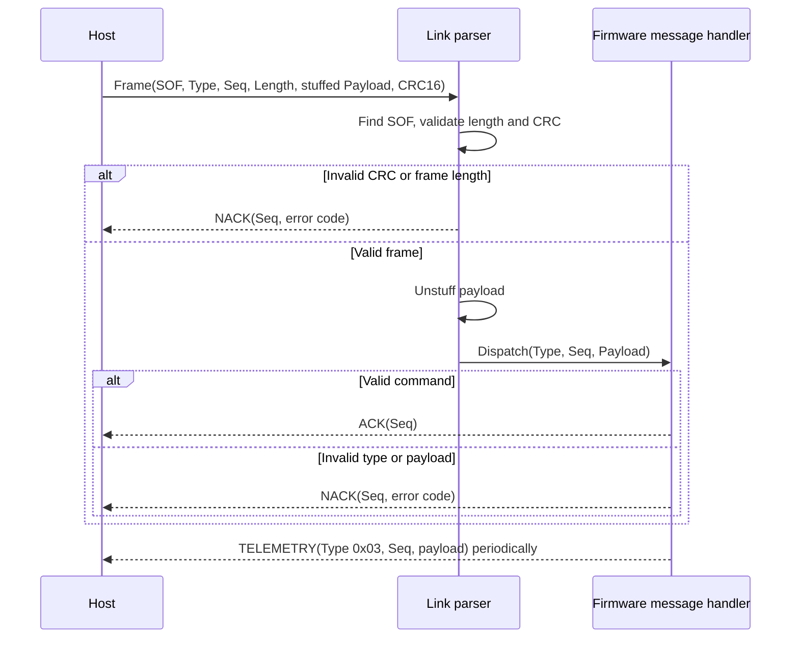

# Framed Link and ROS2 Message Protocol

The serial protocol is split into two layers:

* **Framed link layer**: common binary framing, byte-stuffing, CRC, ACK/NACK, and stream parsing. This layer is application-neutral and can carry ROS2-style binary messages, JSON, or any other payload.
* **ROS2 message layer**: application message types and payload formats for heartbeat, motor, servo, config, and telemetry.

## Framed Link Layer

Frame layout:

| Field | Size | Description |
| --- | ---: | --- |
| `SOF` | 1 byte | Start of frame, always `0xAA` |
| `Type` | 1 byte | Application message type |
| `Seq` | 1 byte | Sequence number |
| `Length` | 2 bytes | Byte-stuffed payload length, little-endian |
| `Payload` | `Length` bytes | Byte-stuffed payload |
| `CRC16` | 2 bytes | CRC-16/CCITT-FALSE over `Type + Seq + Length + stuffed Payload`, little-endian |

Constants:

| Name | Value |
| --- | ---: |
| `SOF` | `0xAA` |
| `ESCAPE` | `0x1B` |
| `ESCAPE_XOR` | `0x20` |
| `ACK` | `0x7E` |
| `NACK` | `0x7F` |
| `ERR_CRC` | `0x01` |
| `ERR_LEN` | `0x02` |

### Byte-Stuffing

Only payload bytes are stuffed. Header and CRC bytes are not stuffed.

Encoding rule:

```text
0xAA -> 0x1B 0x8A
0x1B -> 0x1B 0x3B
other bytes unchanged
```

Decoding rule:

```text
0x1B X -> X ^ 0x20
```

### CRC

CRC parameters:

| Parameter | Value |
| --- | --- |
| Algorithm | CRC-16/CCITT-FALSE |
| Polynomial | `0x1021` |
| Initial value | `0xFFFF` |
| Reflected input/output | No |
| Final XOR | `0x0000` |
| Encoded byte order | Little-endian |

CRC input:

```text
Type + Seq + LengthLow + LengthHigh + StuffedPayload
```

`SOF` is not included.

### Encode Flow

1. Choose `Type` and `Seq`.
2. Encode the application payload.
3. Byte-stuff the payload.
4. Write `Length` as the stuffed payload length.
5. Compute CRC over `Type + Seq + Length + stuffed Payload`.
6. Send:

```text
SOF Type Seq LengthLow LengthHigh StuffedPayload CrcLow CrcHigh
```

Example heartbeat with `Seq = 0` and empty payload:

```text
AA 00 00 00 00 C0 84
```

### Decode Flow

1. Scan the byte stream until `SOF` (`0xAA`) is found.
2. Read `Type`, `Seq`, and little-endian `Length`.
3. Wait until `Length + 7` total frame bytes are available.
4. Reject frames with a stuffed payload length greater than the link-layer maximum.
5. Compute and compare CRC.
6. Byte-unstuff the payload.
7. Dispatch `(Type, Seq, Payload)` to the application handler.

Link-layer errors:

| Error | Response |
| --- | --- |
| CRC mismatch | `NACK` with payload `[Seq, ERR_CRC]` |
| Invalid stuffed length | `NACK` with payload `[Seq, ERR_LEN]` |

## ACK/NACK Frames

ACK frame:

| Field | Value |
| --- | --- |
| `Type` | `0x7E` |
| Payload | `[Seq]` |

NACK frame:

| Field | Value |
| --- | --- |
| `Type` | `0x7F` |
| Payload | `[Seq, ErrorCode]` |

Application-layer errors use the same NACK frame type with application-specific error codes.

## Sequence ownership

`Seq` is an 8-bit identifier allocated independently by each sender and wraps
from `0xFF` to `0x00`. Command messages sent by the host use one shared host
sequence counter; the counter is not reset or maintained separately for each
command type. This makes a request uniquely matchable while it is in flight.

| Message type | Type | Sequence owner | Sequence behavior |
| --- | ---: | --- | --- |
| `HEARTBEAT` | `0x00` | Host | Uses the shared host command sequence; response echoes it |
| `CMD_MOTOR` | `0x01` | Host | Uses the shared host command sequence; response echoes it |
| `CMD_SERVO` | `0x02` | Host | Uses the shared host command sequence; response echoes it |
| `TELEMETRY` | `0x03` | Firmware | Uses the firmware telemetry sequence; no ACK is expected |
| `CMD_CONFIG` | `0x10` | Host | Uses the shared host command sequence; response echoes it |
| `ACK` | `0x7E` | Responder | Copies the request sequence in the header and payload `[Seq]` |
| `NACK` | `0x7F` | Responder | Copies the request sequence in the header and payload `[Seq, ErrorCode]` |

The message type and sequence together identify a protocol exchange. A host
must match an ACK or NACK to the command it sent using the echoed sequence;
the response type determines whether the command succeeded. Telemetry is an
asynchronous firmware-to-host stream and is identified by its firmware-owned
sequence values.

## Request/response sequence

The host sends a framed command to the firmware. The link parser validates the
frame before dispatching the unstuffed payload to the message handler. Valid
commands receive an ACK; invalid commands receive a NACK with the request
sequence and error code. Telemetry is sent asynchronously by the firmware.



## ROS2 Message Layer

ROS2 message types:

| Type | Value | Payload |
| --- | ---: | --- |
| `HEARTBEAT` | `0x00` | Empty |
| `CMD_MOTOR` | `0x01` | `int16 left_pwm`, `int16 right_pwm` |
| `CMD_SERVO` | `0x02` | `uint8 channel`, `uint16 pulse_us` |
| `TELEMETRY` | `0x03` | Battery telemetry payload |
| `CMD_CONFIG` | `0x10` | `uint8 key`, `int32 value` |

All multi-byte ROS2 payload fields are little-endian.

ROS2 application error codes:

| Error | Value | Meaning |
| --- | ---: | --- |
| `ERR_CRC` | `0x01` | CRC failure, generated by link layer |
| `ERR_LEN` | `0x02` | Invalid frame or application payload length |
| `ERR_TYPE` | `0x03` | Unknown ROS2 message type |
| `ERR_CFG` | `0x04` | Unknown config key |
| `ERR_RANGE` | `0x05` | Config value out of allowed range |

### HEARTBEAT

Request payload: empty.

Valid response:

```text
ACK payload = [Seq]
```

Example request with `Seq = 0`:

```text
AA 00 00 00 00 C0 84
```

### CMD_MOTOR

Payload:

| Field | Type | Size |
| --- | --- | ---: |
| `left_pwm` | `int16` | 2 bytes |
| `right_pwm` | `int16` | 2 bytes |

Valid payload length: 4 bytes.

Example values:

```text
left_pwm  =  512 -> 00 02
right_pwm = -512 -> 00 FE
payload          -> 00 02 00 FE
```

Example frame with `Seq = 0`:

```text
AA 01 00 04 00 00 02 00 FE FD 10
```

Invalid payload length response:

```text
NACK payload = [Seq, ERR_LEN]
```

### CMD_SERVO

Payload:

| Field | Type | Size |
| --- | --- | ---: |
| `channel` | `uint8` | 1 byte |
| `pulse_us` | `uint16` | 2 bytes |

Valid payload length: 3 bytes.

Example values:

```text
channel  = 0    -> 00
pulse_us = 1500 -> DC 05
payload         -> 00 DC 05
```

Invalid payload length response:

```text
NACK payload = [Seq, ERR_LEN]
```

### CMD_CONFIG

Payload:

| Field | Type | Size |
| --- | --- | ---: |
| `key` | `uint8` | 1 byte |
| `value` | `int32` | 4 bytes |

Valid payload length: 5 bytes.

Config keys:

| Key | Value | Valid values |
| --- | ---: | --- |
| `TELEM_ENABLE` | `1` | `0` disables telemetry, non-zero enables telemetry |
| `TELEM_RATE_MS` | `2` | `10..5000` |
| `TELEM_MASK` | `3` | Any `uint32` bitmask |
| `TELEM_TIMEOUT_MS` | `4` | Reserved in the current firmware |

Example: enable telemetry with `Seq = 7`:

```text
payload = 01 01 00 00 00
frame   = AA 10 07 05 00 01 01 00 00 00 D6 29
```

Invalid responses:

| Condition | Response |
| --- | --- |
| Payload length is not 5 | `NACK payload = [Seq, ERR_LEN]` |
| Unknown config key | `NACK payload = [Seq, ERR_CFG]` |
| `TELEM_RATE_MS` outside `10..5000` | `NACK payload = [Seq, ERR_RANGE]` |

### TELEMETRY

Telemetry is sent by the device.

Payload layout:

| Field | Type | Size |
| --- | --- | ---: |
| `battery_valid` | `uint8` | 1 byte |
| `battery_ret` | `uint8` | 1 byte |
| `timestamp` | `uint32` | 4 bytes |
| `voltage` | `float32` | 4 bytes |
| `current` | `float32` | 4 bytes |
| `power` | `float32` | 4 bytes |
| `energy` | `float32` | 4 bytes |
| `voltage_raw` | `uint16` | 2 bytes |
| `current_raw` | `uint16` | 2 bytes |

Total unstuffed payload length: 26 bytes.

## Python Encoding Reference

The pytest utilities in `utils/protocol_common.py` implement the same frame format.

Motor payload:

```python
struct.pack("<hh", left_pwm, right_pwm)
```

Servo payload:

```python
struct.pack("<BH", channel, pulse_us)
```

Config payload:

```python
struct.pack("<Bi", key, value)
```
